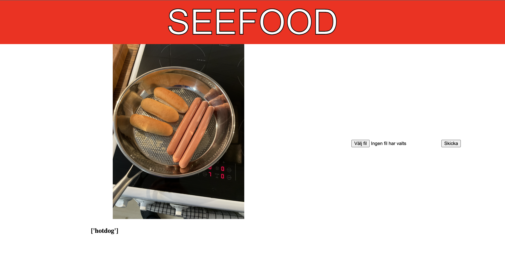
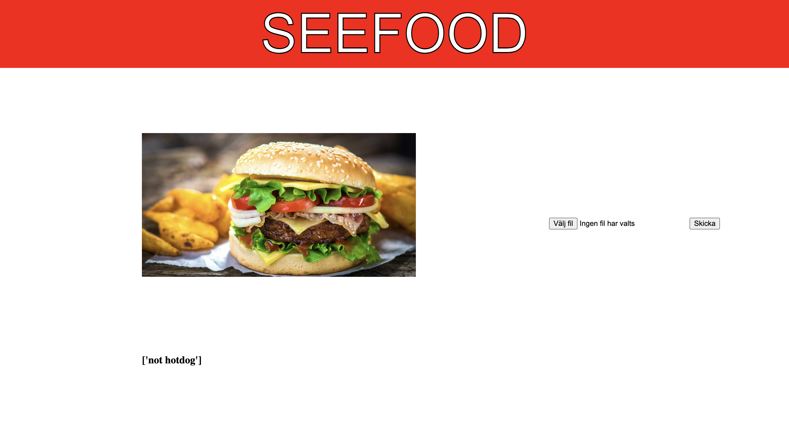

# SeeFood webapp

This big data with ML school project is inspired by Silicon Valley on HBO.

## Installation 

#### Clone repository and pip install requirements

```bash
pip install -r requirements.txt
```

## Usage 
* ### Create new or use existing dataset
```python
"""if you want to import and train new data to dataset"""
# all images/data has to be inside argument folder located in /data/train/{argument}
# (when creating dataset, function will create dir and csv file with same name inside dir)
food = SeeFood().createData('hotdog')
>> /data/train/hotdog/hotdog.csv

# if dataset with multiple folders, i.g hotdog, pizza, hamburger
food = SeeFood().createData(['hotdog', 'pizza', 'hamburger'])
>> /data/train/hotdog_pizza_hamburger/hotdog_pizza_hamburger.csv

"""if dataset & dir already exists"""
# directory with csv file as init argument
food = SeeFood('hotdog_pizza_hamburger')
```
* ### Try different models
```python
from model import SeeFood
food = SeeFood('hotdog_pizza_hamburger')
food.trainTestModelsReport()
>> accuracy 
```

## Run application

